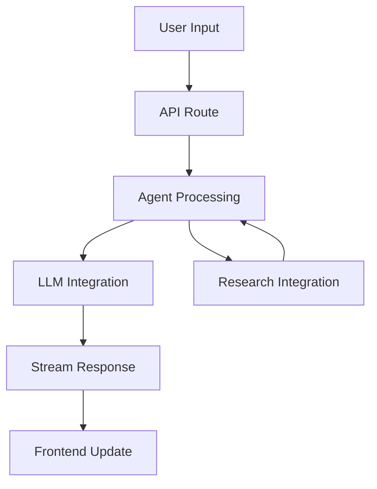

# Conversation Mode Architecture

## Overview

Conversation Mode is a specialized interface for the Deep Research Agent that enables natural, interactive dialogue with users while leveraging our research capabilities. This document outlines the architecture and implementation plan for this feature.

## Architecture

### Package Structure (`packages/conversation/`)
```typescript
packages/conversation/
├── src/
│   ├── types/
│   │   ├── message.ts         # Core message and conversation types
│   │   └── agent.ts          # Agent capabilities and state types
│   ├── ai/
│   │   ├── provider.ts       # LLM configuration and interaction
│   │   ├── prompt.ts         # System prompts and templates
│   │   └── streaming.ts      # Streaming response handling
│   ├── agent/
│   │   ├── core.ts          # Core agent logic and decision making
│   │   ├── memory.ts        # Context and conversation memory
│   │   └── tools.ts         # Agent tool definitions and handlers
│   ├── research/
│   │   └── integration.ts    # Deep Research integration
│   └── index.ts             # Package exports
```

### Component Distribution

1. **Agent Package (`packages/conversation/`)**
   - Core agent logic and capabilities
   - LLM integration and streaming
   - Message processing and context management
   - Tool usage and decision making
   - Research integration capabilities
   - Memory and context persistence

2. **Frontend (`apps/web/`)**
   - UI components and rendering
   - User interaction handling
   - Local UI state management
   - Error handling and display
   - Loading states and animations

3. **API Layer (`apps/web/app/api/`)**
   - Route handlers for agent interaction
   - Streaming response management
   - Error handling and validation
   - Session management
   - History persistence

## Data Flow

### 1. Message Flow


### 2. State Management
- Agent: Maintains conversation context and memory
- API: Handles session state and streaming
- Frontend: Manages UI-specific state
- Database: Persists conversation history

## Implementation Details

### 1. Agent Types
```typescript
interface AgentMessage {
  id: string;
  content: string;
  role: 'user' | 'assistant' | 'system';
  timestamp: Date;
  metadata?: {
    researchContext?: ResearchResult;
    toolUsage?: ToolUsageResult;
    [key: string]: unknown;
  };
}

interface AgentContext {
  messages: AgentMessage[];
  memory: ConversationMemory;
  tools: AvailableTools;
  config: AgentConfig;
}
```

### 2. API Routes
```typescript
// POST /api/conversation
interface ConversationRequest {
  message: string;
  conversationId?: string;
  context?: Record<string, unknown>;
}

// GET /api/conversation/stream
// Server-Sent Events endpoint for streaming responses

// GET /api/conversation/history
interface ConversationHistoryParams {
  conversationId: string;
  limit?: number;
  before?: Date;
}
```

### 3. Frontend Components
```typescript
// UI-specific state management
interface ConversationUIState {
  messages: AgentMessage[];
  isLoading: boolean;
  isStreaming: boolean;
  error?: string;
  input: string;
}
```

## Integration Points

1. **Deep Research Integration**
   - Seamless integration with research capabilities
   - Context-aware research during conversations
   - Knowledge synthesis and summarization
   - Source citation and reference tracking

2. **Database Schema**
```sql
create table conversation_history (
  id uuid primary key default uuid_generate_v4(),
  user_id uuid references auth.users(id),
  messages jsonb not null,
  metadata jsonb default '{}'::jsonb,
  context jsonb default '{}'::jsonb,
  created_at timestamp with time zone default now(),
  updated_at timestamp with time zone default now()
);

create table conversation_memory (
  conversation_id uuid references conversation_history(id),
  key text not null,
  value jsonb not null,
  created_at timestamp with time zone default now(),
  primary key (conversation_id, key)
);
```

## Development Phases

### Phase 1: Core Agent (Current)
1. Basic conversation capabilities
2. LLM integration with streaming
3. Core agent logic and state management
4. Initial API routes and frontend integration

### Phase 2: Research Integration
1. Deep Research integration
2. Context-aware responses
3. Knowledge synthesis
4. Source tracking and citation

### Phase 3: Advanced Capabilities
1. Tool usage and decision making
2. Memory and context management
3. Multi-turn conversation understanding
4. Complex task handling

### Phase 4: Production Features
1. Conversation persistence
2. User session management
3. Error handling and recovery
4. Performance optimizations

## Technical Considerations

1. **Agent Design**
   - Clear separation of agent logic from UI
   - Extensible tool and capability system
   - Robust memory and context management
   - Type-safe interactions

2. **API Design**
   - RESTful endpoints for basic operations
   - SSE for streaming responses
   - Proper error handling and validation
   - Rate limiting and security

3. **Frontend Implementation**
   - Clean component architecture
   - Efficient state management
   - Responsive UI updates
   - Error boundary implementation

4. **Performance**
   - Optimized streaming implementation
   - Efficient memory usage
   - Proper cleanup and resource management
   - Caching where appropriate

## Future Considerations

1. **Advanced Features**
   - Multi-modal interactions
   - Voice interface
   - Image understanding
   - Custom knowledge integration

2. **Scalability**
   - Horizontal scaling of agent processing
   - Distributed memory management
   - Load balancing
   - Message queue integration

3. **Integration**
   - External API access
   - Plugin system
   - Custom tool development
   - Export and import capabilities 