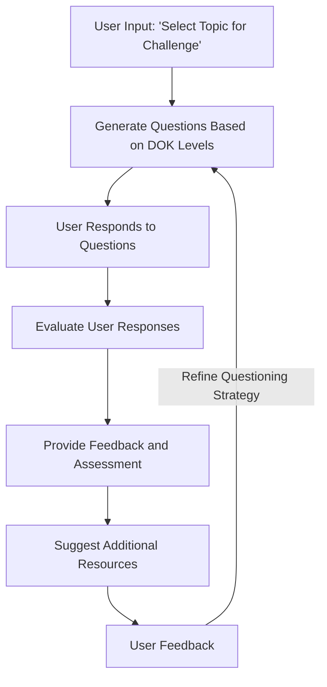

# Brainlift Mode Interaction and Information Flow for Deep Research Agent

## Overview

Brainlift Mode challenges users to deepen their understanding by having the AI ask questions. This mode encourages active learning and self-assessment, helping users identify their knowledge level and areas for improvement.

## Interaction Process

1. **Topic Selection**
   - Users select a topic they want to be challenged on.
   - The system acknowledges the selection and prepares relevant questions.

2. **Questioning Process**
   - The AI generates questions based on the topic's depth of knowledge levels.
   - Users respond to questions, demonstrating their understanding.

3. **Assessment and Feedback**
   - The system evaluates user responses to determine their current knowledge level.
   - Feedback is provided, highlighting strengths and areas for improvement.

4. **Resource Suggestions**
   - Based on the assessment, the system suggests additional resources or topics for further study.

5. **Feedback and Iteration**
   - Users can provide feedback on the questions and assessment process.
   - The system refines its questioning strategy based on user input.

## Benefits

- **Active Learning:** Encourages users to actively engage with the material and assess their understanding.
- **Knowledge Assessment:** Helps users identify their current knowledge level and areas for growth.
- **Personalized Feedback:** Provides tailored feedback and resource suggestions to enhance learning.

## Conclusion

Brainlift Mode offers a challenging and interactive way for users to assess and deepen their knowledge, leveraging AI-driven questioning to facilitate active learning and self-improvement.