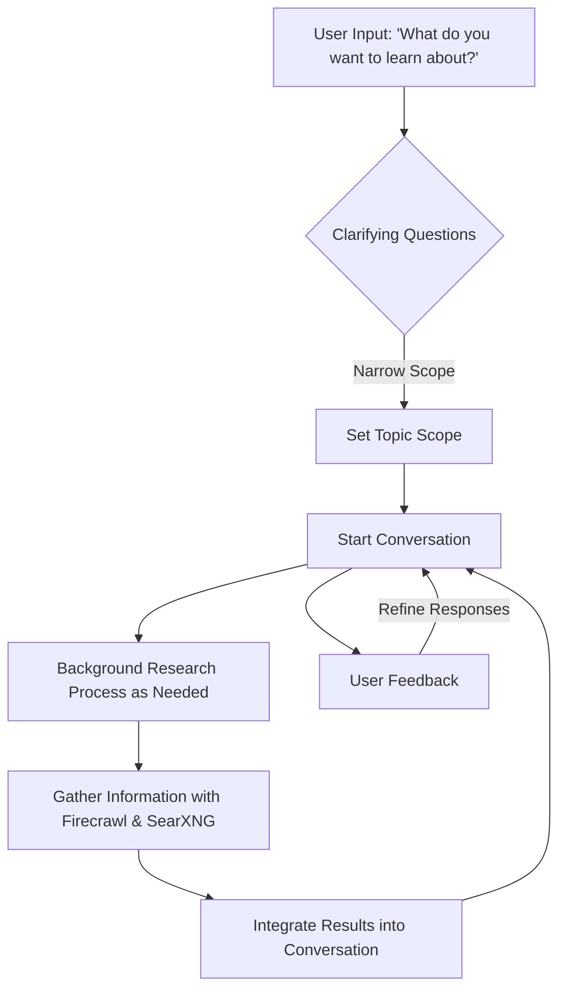

# Conversational Mode Interaction and Information Flow for Deep Research Agent

## Overview

Conversational Mode facilitates a user-led exploration of a topic through dynamic conversation. This mode allows users to guide the learning process based on their interests and questions.

## Interaction Process

1. **Initial User Engagement**
   - The agent begins with an open-ended question: "What do you want to learn about?"
   - Users express their interests, setting a personalized tone for the interaction.

2. **Clarifying Questions**
   - The agent asks targeted questions to narrow down the topic and set the scope.
   - This ensures the research is focused and relevant.

3. **Ongoing Dialogue**
   - The agent maintains a conversation, providing insights and asking follow-up questions.
   - Users can explore different aspects of the topic interactively.

4. **Background Research Integration**
   - As needed, a background process gathers additional information to enrich the dialogue.
   - The results are seamlessly integrated into the conversation.

5. **Feedback and Personalization**
   - Users provide feedback on the interaction and information provided.
   - The system refines responses and research strategies based on user input.

## Benefits

- **Interactive Learning:** Engages users in a dynamic and personalized learning experience.
- **User-Driven Exploration:** Allows users to guide the conversation based on their interests.
- **Comprehensive Insights:** Combines AI knowledge with web-based research for in-depth exploration.

## Conclusion

Conversational Mode offers an engaging and interactive approach to learning, empowering users to explore topics in depth through a personalized dialogue with the AI.