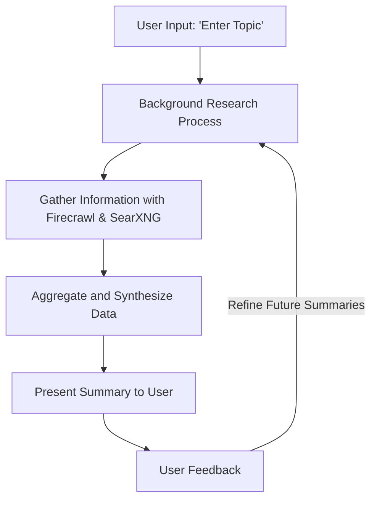

# Overview Mode Interaction and Information Flow for Deep Research Agent

## Overview

The Overview Mode provides users with a broad summary of a topic using the background research process. This mode is ideal for users who need a quick understanding of a subject without deep engagement.

## Interaction Process

1. **Initial User Input**
   - Users input a topic they want to learn about.
   - The system acknowledges the request and begins processing.

2. **Background Research Process**
   - A background process is initiated to gather information using Firecrawl and SearXNG.
   - The system aggregates and synthesizes the data into a concise overview.

3. **Summary Presentation**
   - The system presents a structured summary or report highlighting key points and insights.

4. **Feedback and Refinement**
   - Users can provide feedback on the summary's relevance and clarity.
   - The system uses this feedback to refine future summaries and improve accuracy.

## Benefits

- **Quick Understanding:** Provides a rapid overview of a topic, saving users time.
- **Minimal Interaction:** Requires minimal user input, making it efficient for quick queries.
- **Comprehensive Insights:** Leverages web-based research to ensure up-to-date information.

## Conclusion

Overview Mode is designed for users seeking a quick and efficient way to gain a basic understanding of a topic, leveraging the system's research capabilities to deliver concise and relevant insights.