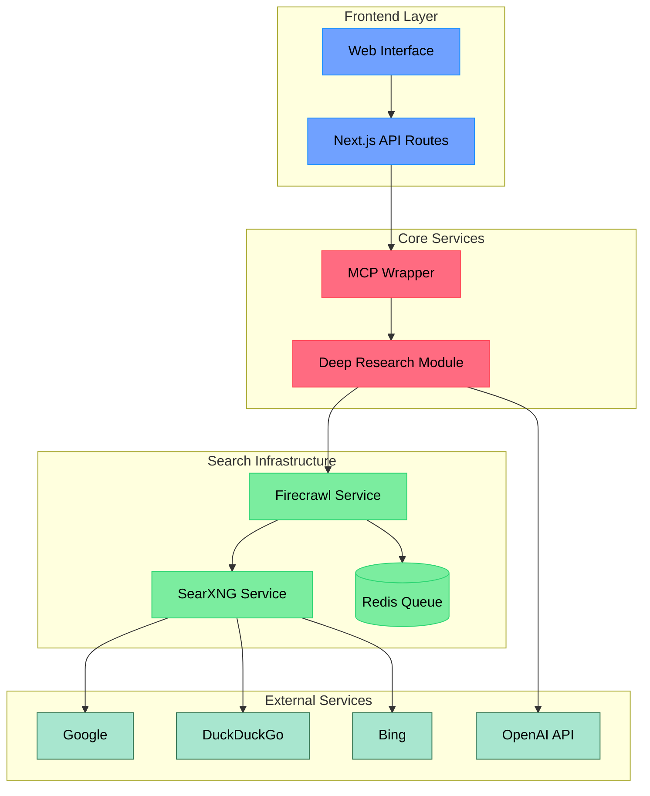

# Deep Research Agent - Project Structure

## Overview

The Deep Research Agent is built as a modular, service-oriented architecture that combines several key components to enable deep, iterative research capabilities. This document outlines each service's role, responsibilities, and how they interact within the system.



## Service Breakdown

### 1. Deep Research Module
**Location:** `packages/deep-research/`
**Purpose:** Core research engine that performs iterative, deep research on topics.
**Key Features:**
- Executes recursive search queries
- Processes and aggregates results
- Generates follow-up questions
- Produces structured research outputs

**Configuration:**
```typescript
// packages/deep-research/src/config.ts
{
  firecrawl: {
    baseUrl: 'http://localhost:3002',
    apiKey: optional,
    concurrencyLimit: 2
  }
}
```

### 2. Firecrawl Service
**Location:** `services/firecrawl/`
**Purpose:** Handles web search and content extraction.
**Key Features:**
- Manages search request queuing
- Coordinates with SearXNG for search results
- Handles content scraping and processing
- Provides rate limiting and job management

**Configuration:**
```env
# services/firecrawl/.env
PORT=3002
REDIS_URL=redis://redis:6379
SEARXNG_URL=http://searxng:8080
SEARCH_PROVIDER=searxng
SEARCH_ENGINES=google,duckduckgo,bing
```

### 3. SearXNG Service
**Location:** `services/searxng/`
**Purpose:** Aggregates results from multiple search engines.
**Key Features:**
- Provides a unified search interface
- Aggregates results from multiple engines
- Handles search engine rotation
- Ensures search reliability

**Integration:**
- Runs as a Docker service
- Accessed by Firecrawl for search operations
- Configured to use multiple search engines

### 4. Redis Queue
**Purpose:** Manages job queues and rate limiting.
**Key Features:**
- Handles search request queuing
- Manages concurrent operations
- Provides rate limiting functionality
- Enables job tracking and management

**Usage:**
- Used by Firecrawl for job management
- Ensures proper request handling
- Prevents service overload

### 5. MCP (Modular Control Plane) Wrapper
**Location:** `packages/mcp/`
**Purpose:** Orchestrates service interactions and provides API endpoints.
**Key Features:**
- Exposes research functionality via API
- Manages service communication
- Handles error recovery and retries
- Provides monitoring and logging

## Service Interactions

### Research Flow
1. **Query Initiation:**
   ```typescript
   // User initiates research
   const result = await deepResearch({
     query: "research topic",
     breadth: 2,
     depth: 1
   });
   ```

2. **Search Processing:**
   - Deep Research module generates search queries
   - Queries are sent to Firecrawl
   - Firecrawl queues requests in Redis
   - SearXNG executes searches across multiple engines

3. **Result Aggregation:**
   - Search results are collected by SearXNG
   - Firecrawl processes and extracts content
   - Deep Research module analyzes and structures data
   - Results are returned to the user

### Error Handling & Recovery
- Services implement retry mechanisms
- Redis ensures job persistence
- Firecrawl handles service failures
- MCP wrapper provides error recovery

## Local Development

### Starting the Stack
```bash
# Start all services
docker-compose up -d

# Verify service health
docker-compose ps

# Check logs
docker-compose logs -f
```

### Service Dependencies
- Deep Research → Firecrawl
- Firecrawl → SearXNG + Redis
- SearXNG → Search Engines
- All Services → Docker Network

## Monitoring & Maintenance

### Health Checks
- Each service provides health endpoints
- Docker handles container health
- Redis monitors queue health
- Firecrawl tracks job status

### Scaling Considerations
- Services are containerized for easy scaling
- Redis can be clustered for higher throughput
- SearXNG supports multiple instances
- Firecrawl workers can be scaled horizontally

## Security & Configuration

### Environment Variables
Each service has its own configuration:
- Deep Research: `.env.local`
- Firecrawl: `.env`
- SearXNG: Docker environment
- Redis: Docker configuration

### Network Security
- Services communicate over internal Docker network
- External access is limited to necessary ports
- API endpoints implement rate limiting
- Authentication is required for sensitive operations 