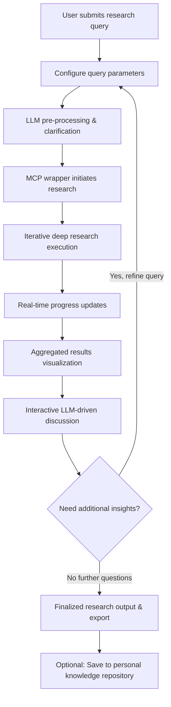

# User Flow for Deep Research Agent

This document outlines the end-to-end user journey across the various segments of the Deep Research Agent application. It serves as a guide for designing the project architecture and defining UI elements.

---

## 1. Overview

The Deep Research Agent transforms natural language research queries into structured, actionable insights. Users are guided through a seamless, interactive experience—from initial query input to real-time research progress, dynamic visualization, and final output refinement—leveraging deep research, interactive LLM conversations, and modular components for scalable performance.

---

## 2. Target Personas

- **Academic Researcher:**  
  Seeks detailed reports and verified academic sources for deeper scholarly analysis.

- **Industry Analyst:**  
  Requires timely, market-relevant insights with scalable analysis and real-time progress updates.

- **Knowledge Engineer:**  
  Automates data aggregation from multiple sources to build a cohesive repository for further processing.

Each persona may emphasize different parts of the journey, yet the overall flow remains consistent.

---

## 3. User Journey Segments

### A. Research Query Submission

- **Landing Interface:**  
  - An inviting, conversational UI welcomes the user, providing a space for natural language input.
  - Clear instructions help users frame their research queries intuitively.

- **Parameter Configuration:**  
  - Users can adjust research parameters (e.g., breadth, depth, targeted sources) through concise UI controls.
  - Input is supported by helper prompts from the integrated LLM to refine initial queries based on context.

- **LLM Pre-Processing:**  
  - The LLM reviews the entered query and may issue clarifications or suggest adjustments.
  - This step ensures that the backend receives well-structured parameters for the deep research module.

---

### B. Research Execution and Real-Time Feedback

- **MCP Wrapper Invocation:**  
  - The query is dispatched to the backend through the MCP wrapper, initiating the deep research process.
  - The direct module approach allows for efficient, asynchronous function calls to the research engine.

- **Iterative Research Process:**  
  - The deep research module conducts iterative and recursive searches using self-hosted services (e.g., Firecrawl and Searxing).
  - The process aggregates insights from various sources and continuously validates emerging data.

- **Progress Updates:**  
  - Real-time feedback is provided via visual progress indicators (e.g., loading bars, percentage complete) on the frontend.
  - Users receive status notifications or periodic updates, ensuring transparency throughout the research cycle.

---

### C. Aggregated Results Visualization

- **Structured Data Output:**  
  - Results are consolidated and presented in both JSON and Markdown formats, ensuring clarity and usability.
  - Visual components (e.g., interactive dashboards, summary cards) built with React, Shadcn, Radix UI, and Tailwind CSS display aggregated data.

- **Detailed and Summary Views:**  
  - Users can toggle between a high-level summary and detailed breakdowns of research findings.
  - Drill-down capabilities allow users to interactively explore specific segments of the research output.

---

### D. Interactive LLM-Driven Discussion

- **Follow-Up Queries:**  
  - Post-research, users can engage in an interactive dialogue with the integrated LLM.
  - This conversation enables users to ask follow-up questions, request further details, or seek clarification on specific research aspects.

- **Dynamic Dialogue Flow:**  
  - The LLM provides contextual analysis, summaries, and counterpoints (e.g., leveraging SpikyPOVs) to stimulate deeper inquiry.
  - Users may iteratively refine their queries based on the discussion, effectively initiating additional research cycles if needed.

---

### E. Post-Research Actions and Knowledge Management

- **Export and Sharing Options:**  
  - Finalized research reports can be exported in various formats (PDF, Markdown, JSON) or shared with collaborators.
  
- **Building a Second Brain:**  
  - Users have the option to save key insights into a personal repository—enabling an evolving “second brain” that tracks learning progress.
  - Intuitive tagging and organization tools help users curate their research outputs for future reference.

- **Feedback Integration:**  
  - Users can provide feedback on research quality and interface usability, which feeds into further product optimizations.

---

## 4. Integration Points of Key Features

- **MCP Wrapper:**  
  Acts as the critical bridge, invoking deep research functions asynchronously and delivering progress and final results to the UI.

- **LLM Integration:**  
  Enhances every user interaction—from pre-processing natural language queries to engaging in dynamic post-result discussions.

- **UI & Visualization Dashboard:**  
  Built with modern React libraries and Tailwind CSS, the dashboard provides a responsive, intuitive interface for monitoring research progress and reviewing outputs.

---

## 5. Overall Flow Diagram (Conceptual)

---

## 6. Summary

The user journey for the Deep Research Agent is designed to be intuitive yet powerful, merging robust back-end research capabilities with a dynamic, interactive UI. From initial natural language query input and parameter configuration to in-depth research, real-time feedback, and interactive discussion, each segment is crafted to guide users toward a comprehensive and actionable research experience. This flow provides a strategic blueprint for architecture development and UI element design, ensuring a cohesive and engaging platform for all user personas.

---