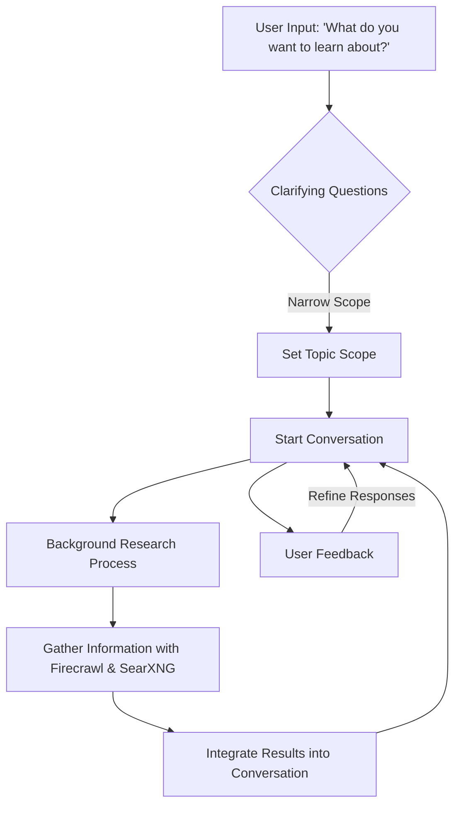

# User Interaction and Information Flow for Deep Research Agent

## Overview

This document outlines the interaction process for the Deep Research Agent, designed to help users rapidly gain domain expertise on any topic. The process combines conversational AI with dynamic research capabilities to provide a personalized and engaging learning experience.

## Interaction Process

1. **Initial User Engagement**
   - The agent begins with an open-ended question: "What do you want to learn about?"
   - This invites users to express their interests freely, setting a personalized tone for the interaction.

2. **Clarifying Questions**
   - The agent asks targeted questions to narrow down the topic and set the scope.
   - This ensures the research is focused and relevant, preventing information overload.

3. **Conversational Continuation**
   - The agent maintains an ongoing dialogue, providing insights and asking follow-up questions.
   - This keeps the user engaged and allows for dynamic adjustments based on their responses.

4. **Background Research Process**
   - A background process is initiated to gather additional information using Firecrawl and SearXNG.
   - The results are integrated into the conversation, enriching the dialogue with external data.

5. **Feedback and Personalization**
   - Users can provide feedback on the relevance and usefulness of the information.
   - The system uses this feedback to refine responses and research strategies, enhancing personalization.

## Interaction and Information Flow Diagram

## Benefits

- **Personalized Experience:** The interaction is tailored to the user's interests and needs, providing a more engaging learning experience.
- **Dynamic Research:** The combination of conversational AI and web-based research ensures comprehensive and up-to-date insights.
- **User Engagement:** Continuous dialogue and feedback mechanisms keep users engaged and informed throughout the process.

## Conclusion

This interaction process effectively balances the use of AI and web-based research tools, helping users progress through different "depth of knowledge" levels and rapidly gain domain expertise on any topic.
